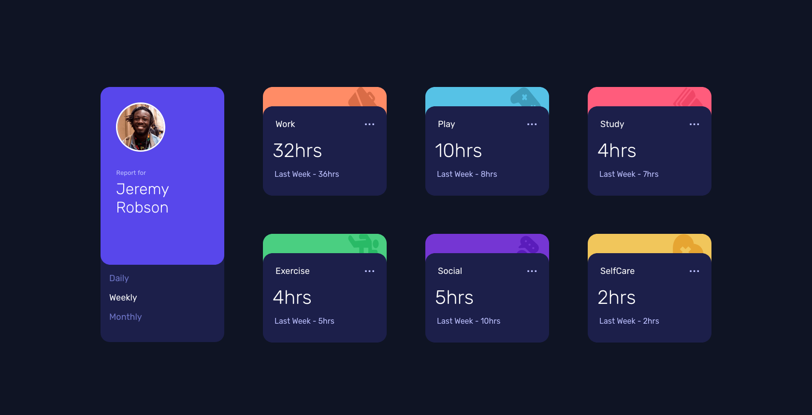
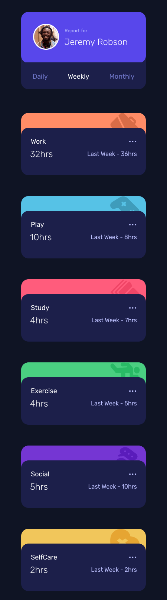

# Frontend Mentor - Time tracking dashboard solution

This is a solution to the [Time tracking dashboard challenge on Frontend Mentor](https://www.frontendmentor.io/challenges/time-tracking-dashboard-UIQ7167Jw). Frontend Mentor challenges help you improve your coding skills by building realistic projects. 

## Table of contents

- [Overview](#overview)
  - [The challenge](#the-challenge)
  - [Screenshot](#screenshot)
  - [Links](#links)
- [My process](#my-process)
  - [Built with](#built-with)
  - [What I learned](#what-i-learned)
  - [Continued development](#continued-development)
  - [Useful resources](#useful-resources)
- [Author](#author)
- [Acknowledgments](#acknowledgments)


## Overview

This project was bootstraped with create React app. This is my second project I have built with React so there were many refactors along the way as I explored different topics like props, state and hooks. I am using the book; Road to React by Robin Wieruch.

### The challenge

Users should be able to:

- View the optimal layout for the site depending on their device's screen size
- See hover states for all interactive elements on the page
- Switch between viewing Daily, Weekly, and Monthly stats

### Screenshot





### Links

- Solution URL: (https://github.com/timbosTours/Fronend-Mentor-time-tracking-dashboard)
- Live Site URL: (https://time-tracking-dashboard-timbostours.netlify.app/)

## My process

I started off with a mobile first approach. I added a few basic styles for the layout but mostly worked on the JSX functionality. I had to understand the difference between props and state and spent a lot of time trying out different hooks that I have been learning about, useState, useEffect etc...

Once I had everything working nicely, I styled finished styling the mobile layout then moved on to desktop then added the hover effects and media queries then a few final touch ups.

### Built with

- Semantic HTML5 markup
- CSS custom properties
- CSS Grid
- Mobile-first workflow
- [React](https://reactjs.org/) - JS library

### What I learned

Being my second React app, I learnt way to much to put here, a couple of cool things were conditional rendering;

```<ul>
                    {/* use conditional rendering to render correct data timeframe based on button input(passed down as props from user component) */}
                        {props.value === 1 ?
                            <div  className='activity-times'>
                                <h1 className='hours'>{activityData.timeframes.daily.current}hrs</h1>
                                <h2 className='previous'>Yesterday - {activityData.timeframes.daily.previous}hrs</h2>

                            </div>
                            : null}
                        {props.value === 2 ?
                            <div  className='activity-times'>
                                <h1 className='hours'>{activityData.timeframes.weekly.current}hrs</h1>
                                <h2 className='previous'>Last Week - {activityData.timeframes.weekly.previous}hrs</h2>
                            </div>
                            : null}
                        {props.value === 3 ?
                            <div  className='activity-times'>
                                <h1 className='hours'>{activityData.timeframes.monthly.current}hrs</h1>
                                <h2 className='previous'>Last Month - {activityData.timeframes.monthly.previous}hrs</h2>
                            </div>
                            : null}
                    </ul>
```

And conditional variables;

```
<menu className='menu'>
                        <button key={'daily'} onClick={() => { setValue(1) }} className={value === 1 ? "clicked" : null}>Daily</button>
                <button key={'weekly'} onClick={() => { setValue(2) }} className={value === 2 ? "clicked" : null} >Weekly</button>
                <button key={'monthly'} onClick={() => { setValue(3) }} className={value === 3 ? "clicked" : null} >Monthly</button>
                </menu>
```

### Continued development

I could probably and a middle media query to smooth out the breakpoints

### Useful resources

- [Road to React](https://www.amazon.com/Road-learn-React-pragmatic-React-js/dp/172004399X/ref=sr_1_1?crid=1MQQYFZP0LXBI&keywords=road+to+react&qid=1669440975&sprefix=road+to+react%2Caps%2C570&sr=8-1) - This is a great book


## Author

- Website - [Timothy Fawcett](https://github.com/timbosTours)
- Frontend Mentor - [@timbosTours](https://www.frontendmentor.io/profile/timbosTours)
- Twitter - [@timbosTours](https://www.twitter.com/timbosTours)


## Acknowledgments

Thanks Frontend Mentor and thank you for reviewing my code :)
